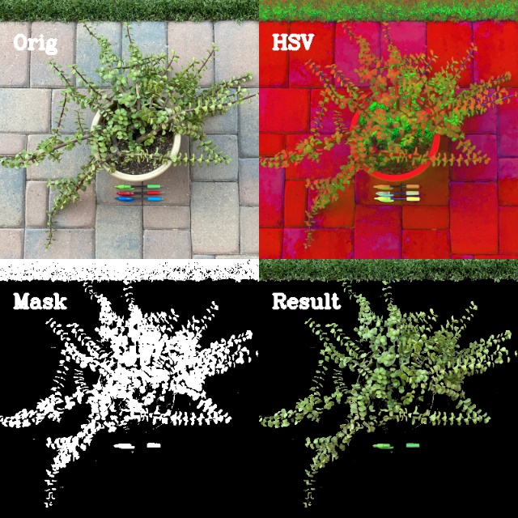
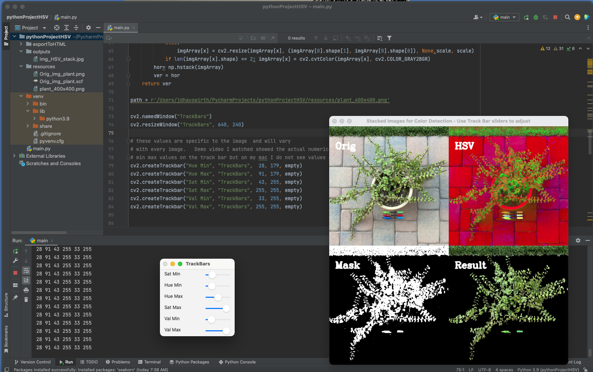

# OpenCV

Created in PyCharm

using this .py script you should be able to:
1)   Upload the image
2)   separate the HSV values using the trackbar window that appears on console
3)   see the images changing realtime on the 2nd window with a composite of 
     4 images (original, HSV, mask and result)
4)   adjust trackbars 

