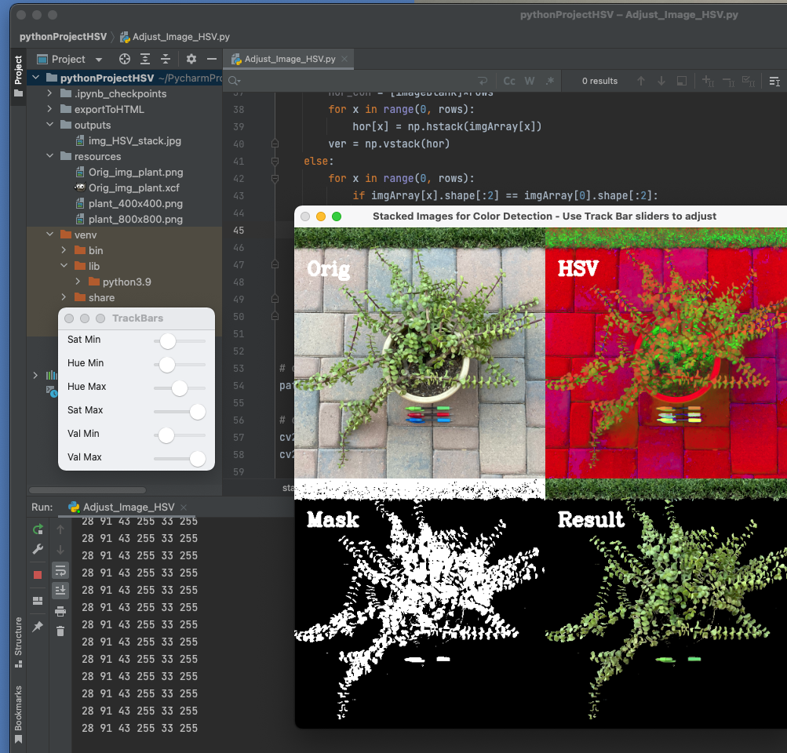

# OpenCV

Created in PyCharm

Using this .py script you should be able to:

1)   Upload the image (or adjust path in .py file to an image of your choice)
2)   Run the script (requires PyCharm env with OpenCV python & numpy)
3)   Separate the HSV values using the trackbar window that appears on console (see screen shot below)
4)   See the images changing realtime on the 2nd window with a composite of 
     4 images (original, HSV, mask and result)
4)   adjust trackbars until you only see the elements/colors in the image.
5)   The three pens are there as reference to RGB (Red, Green and Blue colors)

